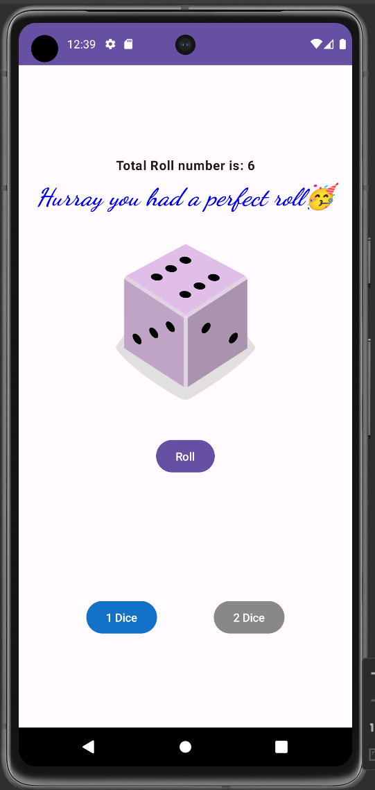
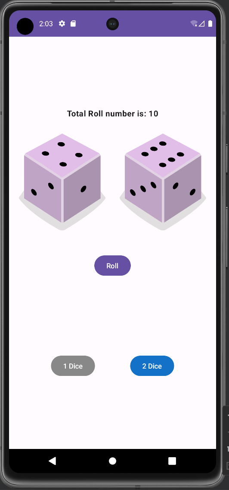

# Dice Roller App

The Dice Roller app is a simple Android application that allows users to roll dice virtually. It uses Jetpack Compose, a modern UI toolkit for building native Android apps with Kotlin. Users can select the number of dice to roll, and each roll generates random numbers for the dice, displaying the corresponding dice images and the total roll number.

## Screenshots
|         One Die        |         Two Dice          |
|:-------------------------:|:--------------------------:|
|  | |

## Features

- Roll virtual dice.
- Choose the number of dice to roll (1 or 2 dice).
- Display dice images based on the roll result.
- Show the total roll number.
- Detect a "perfect roll" when the total roll number equals the maximum possible.

## Getting Started

1. Clone the repository or copy the code to your local development environment.

2. Open the app in Android Studio.

3. Build and run the app on an Android emulator or a physical device.

## How to Use

1. When the app launches, it shows one dice image by default, and the total roll number is set to 0.

2. Tap the "Roll" button to roll the dice. The app will generate random numbers for the dice and display the corresponding dice images. The total roll number will update accordingly.

3. If the total roll number equals the maximum possible (6 for one dice, 12 for two dice), a special message ("Perfect Roll") will be displayed in blue italic text.

4. You can change the number of dice to roll by clicking either "1 Dice" or "2 Dice" buttons. The button for the current selection will have a blue background, while the other will be grayed out.

## Customization

You can customize the app to suit your preferences or extend its functionality. Some ideas include:

- Adding sound effects when rolling the dice.
- Implementing a history feature to display previous rolls.
- Allowing users to select different types of dice (e.g., 4-sided, 8-sided, etc.).
- Adding animations or visual effects to enhance the user experience.

## Acknowledgments

This app was created for learning purposes using Jetpack Compose and Android development techniques.

## License

The Dice Roller app is open-source and distributed under the MIT License. See the `LICENSE` file for more information.

---

Thank you for using the Dice Roller app! We hope you find it useful and enjoyable. If you have any questions or feedback, feel free to contact us. Happy rolling! 🎲
